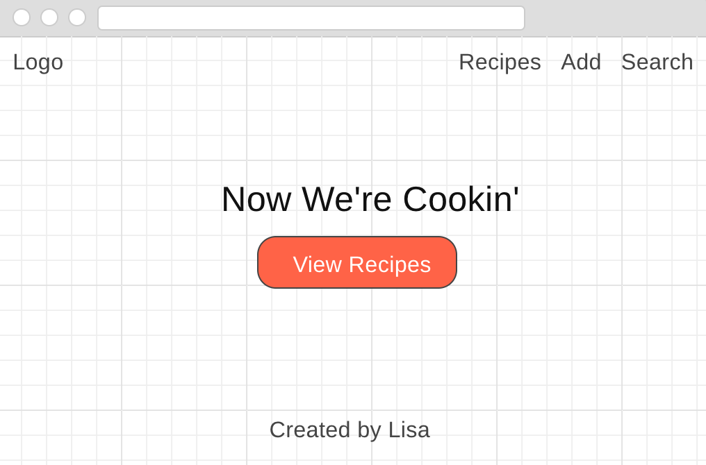
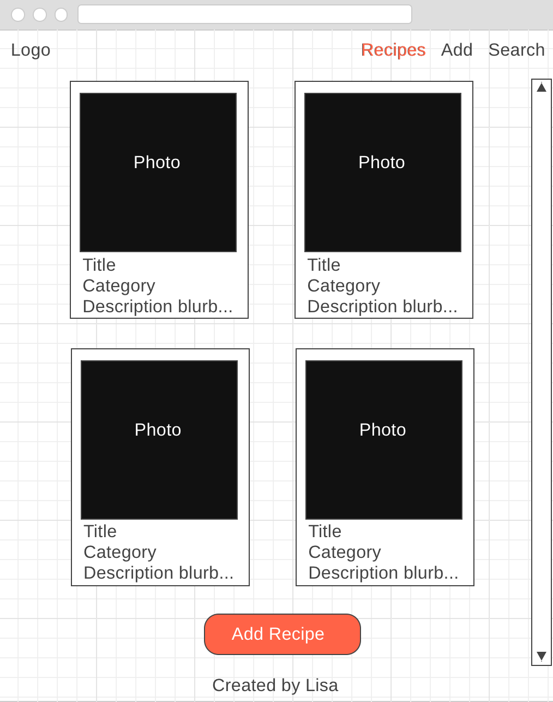
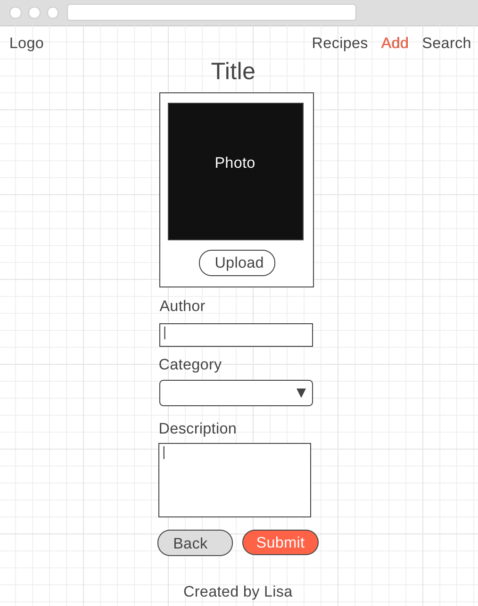
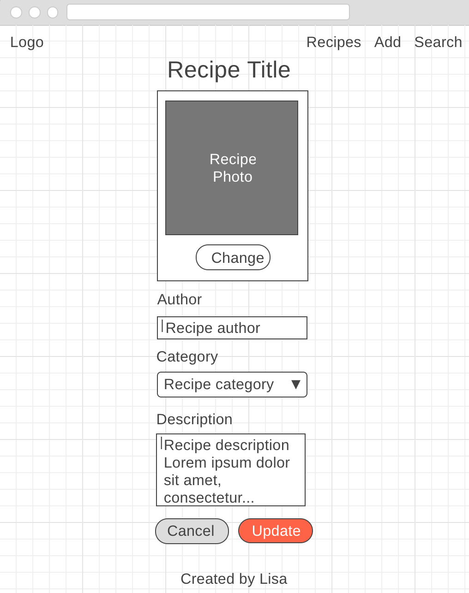
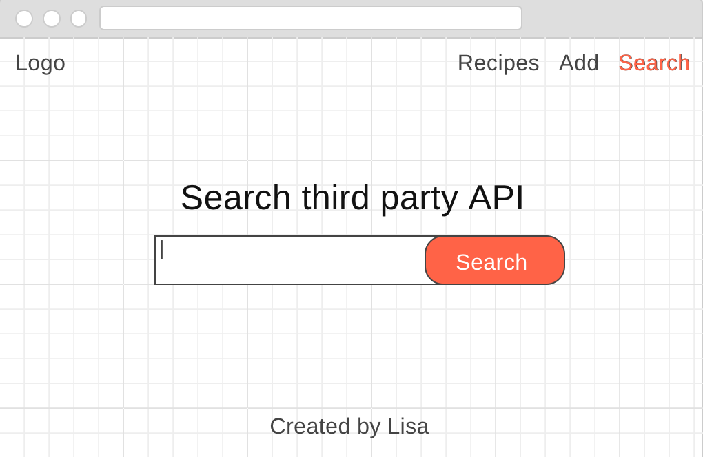

# Project #2 - Now We're Cookin'

## User Story
As a user, I want to have a place where I can create, view, edit, and delete recipes.

### Acceptance Criteria:
Users should be able to:
- Access the database to view all it's current recipes
- Add their own recipes to the database (including title, author, description, photo?, and category)
- Edit recipes in the database
- And delete recipes from the database

## Wireframes
#### Landing on home page



#### Recipes list page



#### Single Recipe view



#### Edit Recipe view



#### Search page



## Technologies Used
- HTML/EJS: the app uses embedded javascript to render information on the page.
- Node & Express: the app has its own server, built using Express.
- MVC Pattern: the app uses the Model View Controller (MVC) programming design pattern. 
- SQL/ PG-Promise: The app persists data and uses multiple SQL tables
- fetch (maybe jQuery)
- CSS3: The app is well-designed and considers user experience and usability
- JavaScript: the app has front-end interactivity
- Spoonacular API: 
- Heroku web hosting

## Approach taken
1. 
2. 

## Major Coding Win
```js
//created a migration that added an ingredients column to my recipe table that used the array datatype
ALTER TABLE recipes 
ADD COLUMN ingredients text[];

//learned how to insert arrays into SQL
UPDATE recipes
SET ingredients = '{"1 cup butter", "1 tablespoon chopped garlic"}'
WHERE id = 5;

//figured out how to display each individual ingredient by using .forEach in ejs
<% recipe.ingredients.forEach(function(ingredient) { %>
    <p class='ingredient'><%= ingredient %></p>
<% }) %>
```

## How-to-use/Download and Installation Instructions

### Objective
The objective of the app is for users to easily be able to create, view, edit, and delete recipes.

1. 
2. 
3. 
4. 
5. 

## Unsolved Problems/Next Steps
- 