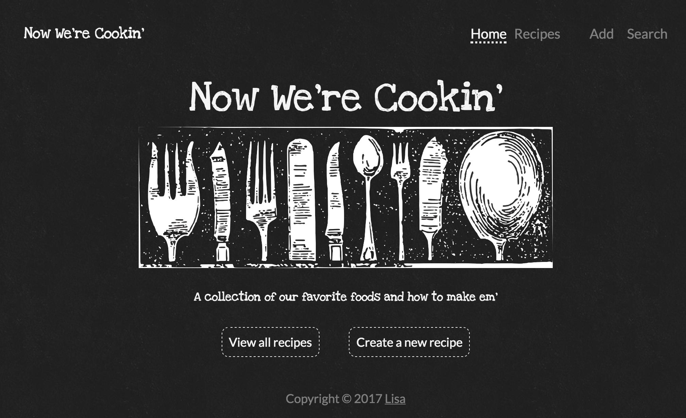

# Project #2 - Now We're Cookin'



## User Story
A user wants to have a place where they can create, view, edit, and delete recipes.

### Acceptance Criteria:
Users should be able to:
- Access the database to view all it's current recipes
- Add their own recipes to the database (including title, author, description, photo?, and category)
- Edit recipes in the database
- And delete recipes from the database

## Wireframes
#### Landing on home page


#### Recipes list page


#### Single Recipe view


#### Edit Recipe view


#### Search page


## Technologies Used
- HTML/EJS: the app uses embedded javascript to render information on the page.
- Node & Express: the app has its own server, built using Express.
- MVC Pattern: the app uses the Model View Controller (MVC) programming design pattern. 
- SQL/ PG-Promise: The app persists data and uses multiple SQL tables
- CSS3: The app is well-designed and considers user experience and usability
- JavaScript: the app has front-end interactivity
- Edamam API: the app uses the third party API powered by Edamam to allow user recipe search functionality
- Isomorphic Fetch: the app uses isomorphic-fetch to fetch the third party api on the back-end
- Heroku web hosting: the app is hosted on Heroku

## Approach taken
1. Drew out the tables & columns of the recipe database.
2. Constructed wireframes to gain an understanding of the flow of the app.
3. Found the third party API to incroporate into the app. 
4. Set up the github repo and project board with a list of steps to completion.
5. Setup the database and populated the tables. 
6. Created model, controller, and route architecture
7. Created views
8. Imported all to app.js
9. Styled views
10. Incorporated third party API
11. Launched to Heroku

 

## Major Coding Win
```js
//created a migration that added an ingredients column to my recipe table that used the array datatype. It's very important to set the default value to an empty array otherwise it will be null and throw errors. 
ALTER TABLE recipes 
ADD COLUMN ingredients text[] SET DEFAULT '{}';

//learned how to insert arrays into SQL
UPDATE recipes
SET ingredients = '{"1 cup butter", "1 tablespoon chopped garlic"}'
WHERE id = 5;

//figured out how to display each individual ingredient by using .forEach in ejs
<% recipe.ingredients.forEach(function(ingredient) { %>
    <p class='ingredient'><%= ingredient %></p>
<% }) %>

// created a function that retrieves individual ingredients and concatenates them to sql format to be updated in the database

// creating a variable for the submit button
const submitButton = document.querySelector('#submit1');

// adding an event listener to the button that prevents the default action
submitButton.addEventListener('click', (event) => {
    event.preventDefault();
    // creating a variable for all the ingredients
    const ingredients = document.querySelectorAll('.item');
    // setting an empty string
    let itemString = '';
    // concatenating the empty string to each ingredient. The last ingredient doesn't get a comma
    ingredients.forEach(function(ingredient, index){
        if(index === (ingredients.length-1)){
            itemString = itemString.concat(`${ingredient.value}`);
        }
        else {
            itemString = itemString.concat(`${ingredient.value},`);
        }
    })
    // setting a variable for the hidden ingredients input box
    const ingredientInput = document.querySelector('#ingredients');
    // changing the value of the ingredient input to the concatenated string with {} to be recognized by sql
    ingredientInput.value = `{${itemString}}`;
    // locating the form 
    const myForm = document.getElementById('input_form');
    // reinitializing the submit function of the form
    myForm.submit(); 
})
```

## Installation Instructions

1. Run `npm install` to install all necessary dependencies listed in the package.json
2. Run all the migration files (un-comment the connect to database lines first) `psql -f migration_date.sql` in ascending order to create and alter the tables. Change the date in the snippet accordingly. 
3. Run the seed file (un-comment the connect to database lines first) `psql -f seed.sql` to populate the tables.
4. To launch the app locally run `npm run dev` and navigate to __localhost:3000__ in your browser.

## Unsolved Problems/Next Steps
- If there is a blank ingredient input, the sql array is incorrect and throws an error. I tried to create an if statement to check for empty values but it gave more errors.
- I couldn't get the window.onscroll function to work for the back to top button
- Post MVP I'd like to incorporate user authentication
